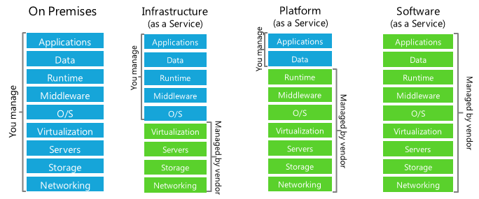
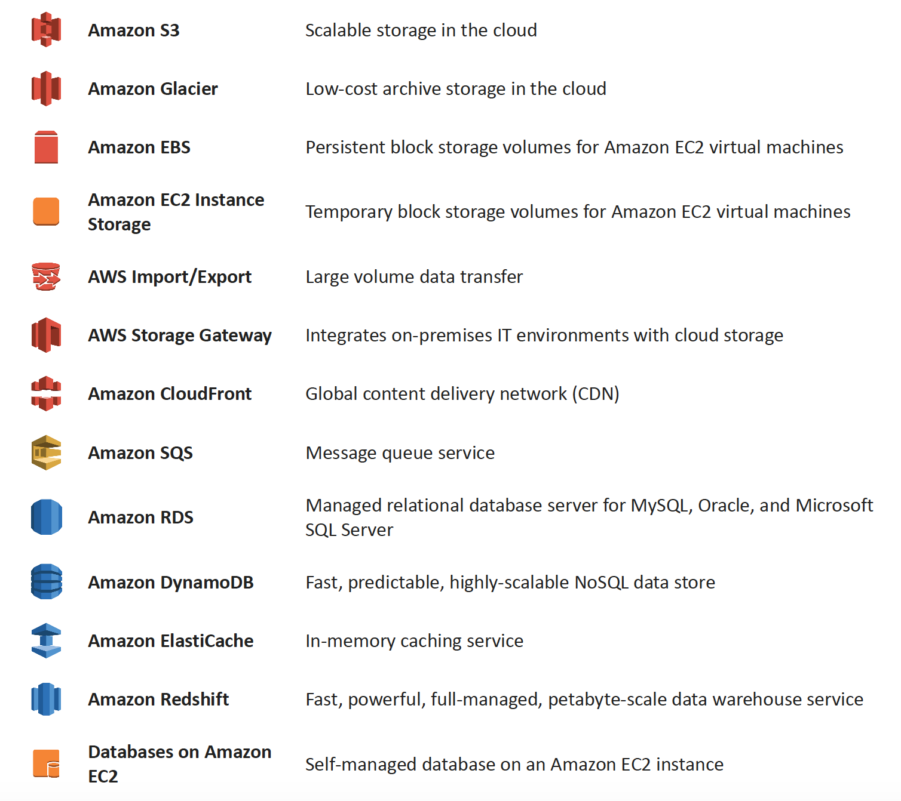
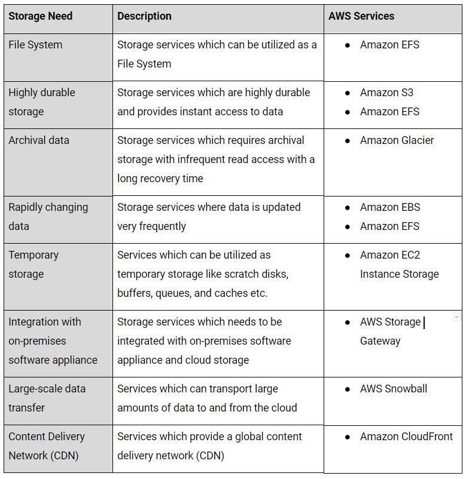
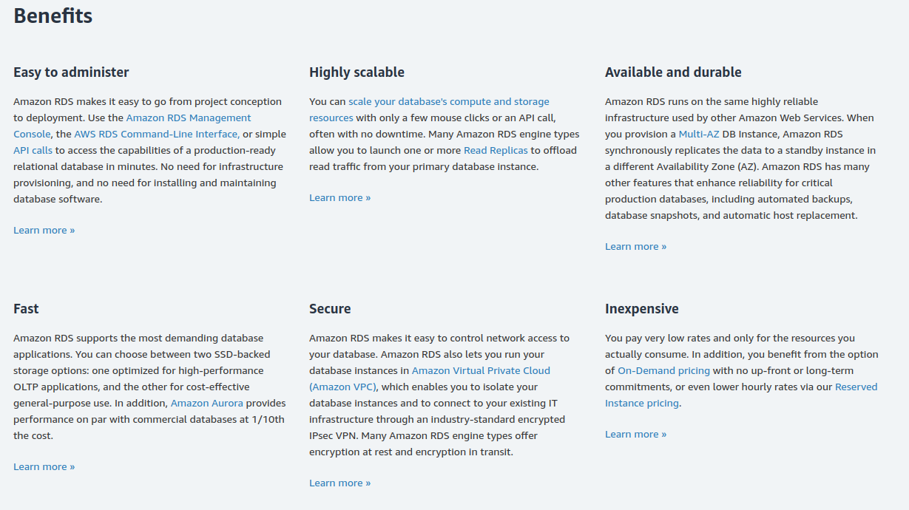
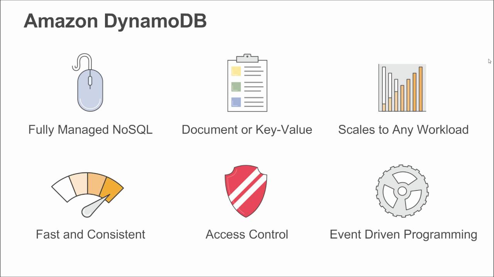
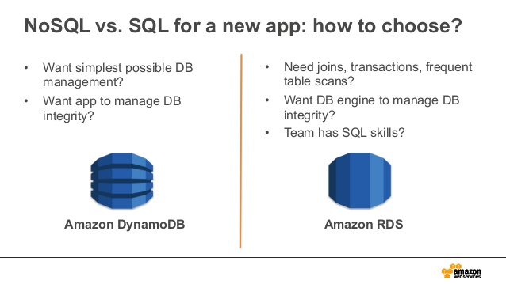

# AWS

  
## What is AWS

Data centers distributed Worldwide
On-demand delivery of IT resources 
Shared and dedicated resources

Benefits:
- economies of scale
- accounts isolated at the hypervisor level
- pay-as-you-go pricing
- no up front cost
- reduced maintenance and admin costs
- organised into product categories

Divided into geographic **regions**, chosen in order to:
- optimise latency,
- minimise costs,
- address regulatory requirements.

Each further divided into **availability zones**:
- physically isolated from each other,
- connected to each other with fast, private fiber-optic networking.

To deliver content to end users with lower latency, **Amazon CloudFront** (fast content delivery network (CDN)) uses a global network of 187 Points of Presence (176 **Edge Locations** and 11 Regional Edge Caches) in 69 cities across 30 countries.
- caches content at edge locations for high performance delivery of content
- provides DDoS protection

### Cloud Computing Models

#### IaaS: Infrastructure as a Service
Contains the basic building blocks for cloud IT
Eg. VPC, EC2, EBS

#### PaaS: Platform as a Service
AWS manages the underlying infrastructure (usually hw and os)
Eg. RDS, EMR, ElasticSearch

#### SaaS: Software as a Service
Completed product that is run and managed by the service provider. Mostly refers to end-user applications
Eg. Web-based email, Office 365, Salesforce

#### FaaS: Function as a Service or Serverless Computing
Allows you to build and run applications and services without thinking about servers. 
Eg. S3, Lambda, DynamoDB, SNS

## AWS Solutions

### [AWS Storage Solutions](https://mitrai.com/tech-guide/eight-types-of-aws-storage-services-explained/)

[Storage Cases](cases/storage-cases.md)

### AWS Database Services

**RDS**: Fully managed Database Service, makes easy to launch and scale DB on AWS. Services: MySQL (MariaDB, Aurora), PostgreSQL (std, Aurora PostgreSQL), Microsoft SQL Server, Oracle

**DynamoDB**: NoSQL Database as a Service. Serverless Service. High speed, low latency performance.

**Redshift**: Fast, fully managed, petabyte scalable data warehouse, based on the PostgreSQL engine. Perfect for Big Data solutions.

**ElastiCache**: In memory data store in the cloud, allows to retrieve information from fast, fully managed, in memory caches.

**Database Migration Service** (DMS): orchestrates the migration of databases over to AWS easily and securely. It also can migrate data between different database engines.

**Neptune**: Fast, reliable, fully managed graph database. Optimized for storing relationships, and querying the graph with ms latency. 

#### Amazon Relational Database Service

(Amazon RDS) makes it easy to set up, operate, and scale a relational database in the cloud. It provides cost-efficient and resizable capacity while automating time-consuming administration tasks such as hardware provisioning, database setup, patching and backups. It frees you to focus on your applications so you can give them the fast performance, high availability, security and compatibility they need.

#### DynamoDB

[AWS Database Services](https://www.sumologic.com/blog/migrating-aws-database-services/)
[AWS Database Services Complete Overview: RDS vs Redshift vs DynamoDB vs SimpleDB](https://www.cloudberrylab.com/resources/blog/aws-database-services-complete-overview-rds-vs-redshift-vs-dynamodb-vs-simpledb/)

### AWS Compute Services

**EC2** (Elastic Compute Cloud): provides a virtual service in the AWS cloud. Pay for what your use. Range of options with variety of memory and computing capabilities, optimized for different use cases.

**EC2 Autoscaling**: Dynamically scales EC2 capacity up or down (by launching or terminating instances), automatically according to conditions pre defined. It also performs health checks on the instances, and replace them if they became unhealthy.

**Lightsail**: Easiest way to launch virtual service running applications in the AWS cloud. AWS provides everything needed including DNS managemente, storage to get you up and running as quickly as possible. 

**ECS** (Elastic Container Service): Highly scalable, high performance container management service for Docker containers. Containers are runned in a managed cluster of EC2 instances.

**Lambda**: Serverless service, lets you run code in the aws cloud without worrying about provisioning or managing services.

### Networking and Content Delivery

**Amazon CloudFront**: Global content delivery network (CDN) delivers frequently accessed content to 169 edge locations across the globe. Low latency, high speed transfer speed for end users. DDoS protection.

**Virtual Private Cloud**: Lets you provision a logically isolated section of the AWS cloud, and you can launch AWS resources within. 

**Directed Connect**: High speed dedicated connection to the AWS cloud. Enterprises use it to establish private connections to the cloud where standard internet connection wouldn't ba adequate. 
 
**Elastic Load Balancing**: Automatically balances traffic to multiple EC2 instances and also availability zones. Provides high availability and fault tolerance, and by pass unhealthy instances.
 
**Route 53**: Highly available and scalable domain name system (DNS), and handles direct traffic to your app and redirects it to backend web server based on rues.
 
**API Gateway**: Fully managed service, makes it easy to developers to create and deploy secure programming interfaces and APIS at any scale. It handles up to 1000 concurrent API calls. Serverless service.

## Ways of interacting with AWS

1. Management Console
2. SDKs for diverse programming languages
3. AWS REST API through HTTP requests
4. AWS CLI

## Guides
 
### Overview of AWS
- [AWS General Reference](guides/aws-general.pdf)
- [Overview of AWS White Paper](guides/aws-overview.pdf)
- [Cloud Best Practices](guides/AWS_Cloud_Best_Practices.pdf)

### Business Case for AWS
- [Introduction to AWS Economics](guides/introduction-to-aws-cloud-economics-final.pdf)
- [The Business Value of AWS](guides/aws-whitepaper-business-value-of-aws.pdf)
- [How AWS Pricing Works](guides/aws_pricing_overview.pdf)
- [AWS Answers to Key Compliance Questions](guides/AWS_Answers_to_Key_Compliance_Questions.pdf)
- [Overview of Security Processes](guides/AWS_Secutiry_Whitepaper.pdf)

## AWS Reference Links
  
[Certification](https://aws.amazon.com/certification/)

[Documentation](https://docs.aws.amazon.com/index.html)

[Whitepapers](https://aws.amazon.com/whitepapers/)

[Products](https://aws.amazon.com/products/)

[What's New with AWS?](https://aws.amazon.com/new/)
  
